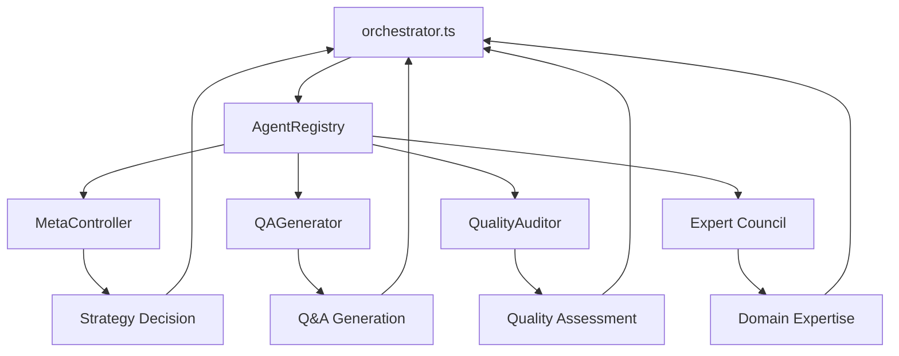

# System Modules Overview

## Core Architecture Modules

### `/src/core/` - System Core

- **orchestrator.ts**: Main system orchestrator, coordinates all agents
- **baseAgent.ts**: Abstract base class for all agents
- **metaController.ts**: Strategic decision-making and complexity analysis
- **performanceGuardian.ts**: Performance monitoring and optimization

### `/src/agents/` - Agent Implementations

- **qaGenerator.ts**: Q&A pair generation with LLM integration
- **qualityAuditor.ts**: Multi-level quality assessment
- **promptArchitect.ts**: Prompt optimization and engineering
- **psychologySpecialist.ts**: User psychology and communication
- **linguisticsEngineer.ts**: Language structure optimization
- **domainConsultant.ts**: Domain-specific expertise
- **cognitiveScientist.ts**: Expert thinking process modeling

### `/src/shared/` - Shared Infrastructure

- **types.ts**: All TypeScript interfaces and types
- **logger.ts**: Centralized logging system
- **registry.ts**: Agent registration and discovery
- **errors.ts**: Standardized error handling
- **env.ts**: Environment variable management

### `/src/clients/` - External Integrations

- **anthropicAdapter.ts**: Anthropic Claude API integration
- **llmAdapter.ts**: Unified LLM interface

### `/src/utils/` - Utility Functions

- **cost.ts**: Cost calculation and tracking
- **log.ts**: Log formatting utilities

## Agent Communication Flow

## Inter-Module Dependencies

- **Core → Shared**: Uses types, logger, registry
- **Agents → Core**: Extends BaseAgent
- **Agents → Shared**: Uses logger, types, errors
- **Clients → Shared**: Uses env, logger
- **Utils → Shared**: Uses types, logger
