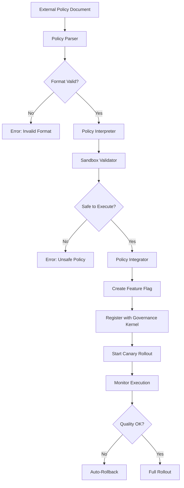

# Policy DSL Specification

**Phase**: Phase 2C
**Status**: Draft
**Version**: 0.1.0
**Created**: 2025-10-08
**Purpose**: Define Domain-Specific Language for external policy integration

---

## Overview

The Policy DSL (Domain-Specific Language) enables the system to:

1. **Parse** external policy documents (RFC, guidelines, specifications)
2. **Interpret** policy rules into executable constraints
3. **Validate** policies in a sandboxed environment
4. **Integrate** approved policies into the Governance Kernel
5. **Monitor** policy execution and auto-adapt when needed

This bridges the gap between **human knowledge** (documents) and **system behavior** (code).

---

## Design Principles

### 1. Safety First
- All external policies run in **sandbox** before production
- **Feature Flags** for gradual rollout (canary → full)
- **Auto-rollback** if policy degrades quality

### 2. Language Neutrality
- Support **multiple input formats**: Markdown, YAML, JSON, plain text
- Auto-detect policy intent using NLP + pattern matching

### 3. Composability
- Policies can **reference** other policies
- Support **inheritance** and **override**
- Conflict resolution using **priority ordering**

### 4. Auditability
- Every policy evaluation logged to `governance.jsonl`
- Decision trace: Input → Parse → Validate → Execute → Result

---

## Policy DSL Syntax

### Basic Structure

```yaml
policy:
  name: "policy-name"
  version: "1.0.0"
  type: "architecture" | "threshold" | "quality" | "security"
  priority: 1-10  # Higher = more important

  conditions:
    - expression: "metric > threshold"
      operator: ">" | "<" | "==" | "!=" | ">=" | "<="

  actions:
    - type: "alert" | "block" | "adjust" | "log"
      target: "string"
      params: {}

  metadata:
    source: "rfc" | "spec" | "guideline" | "external"
    author: "string"
    tags: []
```

### Expression Language

```typescript
// Supported operators
AND, OR, NOT, >, <, ==, !=, >=, <=, IN, NOT_IN

// Functions
abs(value)           // Absolute value
avg(array)           // Average
max(array)           // Maximum
min(array)           // Minimum
count(array)         // Count items
exists(key)          // Check if key exists
matches(regex)       // Regex match

// Context variables
metrics.*            // Access metrics (e.g., metrics.entity_coverage)
baseline.*           // Access baseline values
current.*            // Access current run values
history.*            // Access historical data
config.*             // Access configuration
```

---

## Sample Policies

### Policy 1: Drift Detection Alert

```yaml
policy:
  name: "entity-coverage-drift-alert"
  version: "1.0.0"
  type: "threshold"
  priority: 5

  description: >
    Alert when entity coverage drifts more than 15% from baseline.
    Trigger feedback loop to generate diversity plan.

  conditions:
    - expression: "abs(current.entity_coverage - baseline.entity_coverage) > 0.15"
      description: "Drift exceeds 15%"

    - expression: "current.entity_coverage < baseline.entity_coverage"
      description: "Degradation (not improvement)"

  actions:
    - type: "alert"
      target: "governance.ledger"
      params:
        severity: "high"
        message: "Entity coverage degraded by {drift}%"

    - type: "trigger"
      target: "qa_feedback_loop"
      params:
        auto_adjust: false
        create_diversity_plan: true

  feature_flag:
    name: "FEATURE_ENTITY_DRIFT_ALERT"
    default: false
    canary_percentage: 10

  metadata:
    source: "rfc"
    author: "Phase 2B Team"
    tags: ["drift", "quality", "entity-coverage"]
```

### Policy 2: Plugin Conflict Resolution

```yaml
policy:
  name: "plugin-conflict-resolution"
  version: "1.0.0"
  type: "architecture"
  priority: 8

  description: >
    Prevent conflicting quality checkers from running simultaneously.
    Use priority-based resolution when conflicts detected.

  conditions:
    - expression: "exists(active_plugins)"
      description: "Plugins are active"

    - expression: "count(conflicts) > 0"
      description: "Conflicts detected"

  actions:
    - type: "block"
      target: "plugin_registry"
      params:
        conflict_strategy: "priority"
        keep_higher_priority: true

    - type: "log"
      target: "governance.ledger"
      params:
        event_type: "plugin_conflict_resolved"
        resolution: "priority-based"

  feature_flag:
    name: "FEATURE_PLUGIN_CONFLICT_RESOLUTION"
    default: true
    canary_percentage: 100

  metadata:
    source: "internal"
    author: "Plugin Registry"
    tags: ["plugin", "conflict", "architecture"]
```

### Policy 3: Budget Auto-Disable

```yaml
policy:
  name: "budget-auto-disable"
  version: "1.0.0"
  type: "security"
  priority: 10  # Highest priority (budget safety)

  description: >
    Automatically disable expensive plugins when budget limit is exceeded.
    Prevents runaway costs.

  conditions:
    - expression: "current.total_cost > config.max_budget"
      description: "Budget exceeded"

    - expression: "exists(active_expensive_plugins)"
      description: "Expensive plugins are active"

  actions:
    - type: "disable"
      target: "expensive_plugins"
      params:
        plugins: ["ragas-eval", "multi-view-embedding"]
        reason: "Budget limit exceeded"

    - type: "alert"
      target: "governance.ledger"
      params:
        severity: "critical"
        message: "Budget limit exceeded - disabled expensive plugins"

    - type: "rollback"
      target: "baseline"
      params:
        baseline_tag: "integration-base"

  feature_flag:
    name: "FEATURE_BUDGET_AUTO_DISABLE"
    default: true
    canary_percentage: 100

  metadata:
    source: "internal"
    author: "Budget Controller"
    tags: ["budget", "safety", "auto-disable"]
```

---

## Parser Architecture

### Input → Parse → Validate → Execute → Monitor

```typescript
// 1. Policy Parser
class PolicyParser {
  parse(input: string | object): ParsedPolicy {
    // Auto-detect format (YAML, JSON, Markdown)
    // Extract policy structure
    // Validate syntax
  }
}

// 2. Policy Interpreter
class PolicyInterpreter {
  evaluate(policy: ParsedPolicy, context: PolicyContext): PolicyResult {
    // Evaluate conditions
    // Execute actions
    // Return result
  }
}

// 3. Sandbox Validator
class PolicySandbox {
  validate(policy: ParsedPolicy): ValidationResult {
    // Run in isolated environment
    // Test against sample data
    // Check for safety violations
  }
}

// 4. Policy Integrator
class PolicyIntegrator {
  integrate(policy: ParsedPolicy, validation: ValidationResult): IntegrationResult {
    // Create Feature Flag
    // Register with Governance Kernel
    // Start canary rollout
  }
}
```

---

## Execution Flow



---

## Integration with Existing System

### 1. Governance Kernel Hook

Already implemented in Phase 2B Step 3:

```typescript
// src/core/governance/kernel.ts
async evaluateExternalPolicy(
  policyDoc: ExternalPolicyDocument
): Promise<PolicyEvaluation> {
  // 1. Parse using Policy Parser (Phase 2C)
  // 2. Validate using Sandbox (Phase 2C)
  // 3. Generate Feature Flag
  // 4. Log to governance ledger
}
```

### 2. Feature Matrix Integration

```yaml
# configs/quality/feature-matrix.yml
policy_dsl:
  enabled: false  # Default OFF
  parser_version: "0.1.0"
  sandbox_enabled: true
  auto_integration: false  # Manual approval initially
```

### 3. Metrics Drift Integration

Policies can trigger feedback loop:

```typescript
// When policy detects drift
if (policyResult.action === "trigger_feedback_loop") {
  await qaFeedbackManager.runFeedbackLoop();
}
```

---

## Safety Mechanisms

### 1. Sandbox Execution

- Isolated environment (VM or container)
- Limited resource access (CPU, memory, I/O)
- Time limits (5s max execution)
- No side effects allowed

### 2. Validation Checkers

- Syntax validation (YAML/JSON schema)
- Security validation (no dangerous operations)
- Performance validation (complexity limits)
- Conflict validation (no policy conflicts)

### 3. Gradual Rollout

1. **Canary (10%)**: Test on small subset
2. **Monitor**: Check metrics drift
3. **Expand (50%)**: If stable
4. **Full (100%)**: If no degradation
5. **Auto-Rollback**: If quality drops

---

## Implementation Roadmap

### Phase 2C Step 1: Parser + Interpreter (Week 1)

- [ ] Implement `PolicyParser` (YAML, JSON, Markdown)
- [ ] Implement `PolicyInterpreter` (expression evaluator)
- [ ] Add tests (20+ cases)

### Phase 2C Step 2: Sandbox Validator (Week 2)

- [ ] Implement `PolicySandbox` (isolated execution)
- [ ] Add safety checkers (security, performance)
- [ ] Add tests (15+ cases)

### Phase 2C Step 3: Integration (Week 3)

- [ ] Implement `PolicyIntegrator`
- [ ] Connect to Governance Kernel hook
- [ ] Add canary rollout mechanism
- [ ] Add auto-rollback on degradation

### Phase 2C Step 4: External Docs (Week 4)

- [ ] Add support for RFC documents
- [ ] Add support for Markdown guidelines
- [ ] Add NLP-based policy extraction
- [ ] Add human-approval workflow

---

## Success Criteria

- ✅ Parse 3 sample policies without errors
- ✅ Sandbox validation passes for all safe policies
- ✅ Canary rollout works with auto-rollback
- ✅ Integration with Governance Kernel seamless
- ✅ Metrics drift triggers policy actions correctly
- ✅ External RFC documents auto-convert to policies

---

## References

- Phase 2B Step 3: QA Feedback Loop + Plugin Integration
- `src/core/governance/kernel.ts` - External Policy Hook
- `configs/quality/feature-matrix.yml` - Feature Configuration
- `reports/metrics-drift.json` - Drift Detection

---

## Appendix: Advanced Features (Future)

### Machine Learning Policy Adaptation

```yaml
policy:
  name: "ml-drift-prediction"
  type: "threshold"

  ml_model:
    type: "linear_regression"
    training_data: "reports/governance/prediction-train.jsonl"
    features: ["cost_delta", "metric_delta"]
    target: "drift_likely"

  actions:
    - type: "predict"
      target: "drift_detector"
      params:
        threshold: 0.8  # 80% confidence
```

### Policy Composition

```yaml
policy:
  name: "composite-quality-policy"
  type: "quality"

  composed_of:
    - policy: "entity-coverage-drift-alert"
      weight: 0.5
    - policy: "evidence-alignment-check"
      weight: 0.3
    - policy: "question-balance-check"
      weight: 0.2

  aggregation: "weighted_average"
```

---

**Status**: Draft for Phase 2C
**Next Step**: Review with team → Start Parser implementation
**Author**: Claude Code
**Date**: 2025-10-08
